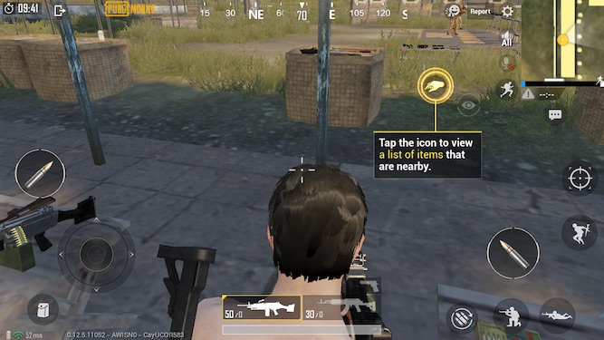

# pubc
=======

pubg the way it's supposed to be (with MFI controller support)

Building: (requires Xcode)

1. check out the project recursively
2. make stage (or make package if you have dpkg installed)

How it works:

1. I map the x,y coordinates of each of the buttons on this screenshot I took on my 6s

https://github.com/lechium/ItsScience/blob/master/pubg/PUBGControllerManager.m#L719

ie case kPGBActionTypeInventory the output is essentially CGPointMake(48, 343) (after being translated for the screen size) The inventory button is on the bottom left X: 48, y: 343

2. Hook IOSAppDelegate and our PUBGController class

3. This class listens for game controllers and upon receiving one, sets it up to receive value change handlers
ie https://github.com/lechium/ItsScience/blob/master/pubg/PUBGControllerManager.m#L482

4. Map buttons to different CGPoints that touches are simulated for on the screen.
still looking at sample code from above on like 482+ you'll see if pressed is true, then it gets the mapped control for the button constant (in this case ButtonX) [[self IOSView] tapAtPoint:run];

5. The touch events simulation was lifted and modified from the awesome KIF framework. Mostly from this folder https://github.com/kif-framework/KIF/tree/master/Additions 

Custom button mapping:

pubg/layout/private/var/mobile/Library/Preferences/com.nito.pubc.plist.og

(it is named as .og because postinst moves it to com.nito.pubc.plist if it doesn't already exist)

PUBGDefines.h has all the constants available that can be changed in that plist file to their corresponding buttons. You can change the values in the plist before you build and install it, OR you can change those values on device directly at /private/var/mobile/Library/Preferences/com.nito.pubc.plist

Wiki Page: https://wiki.awkwardtv.org/wiki/Pubc

